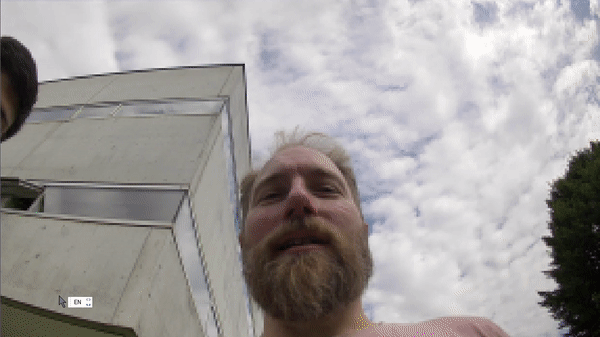
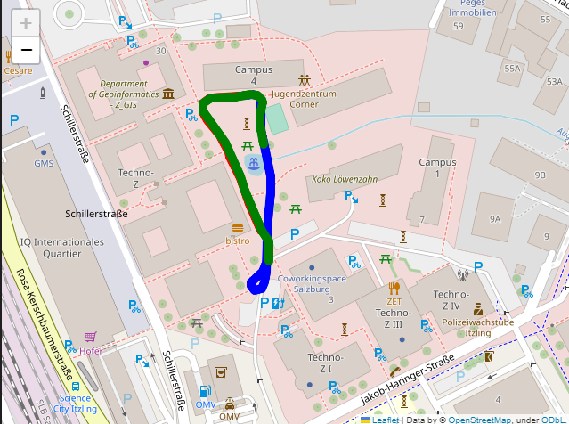

# Boreal SDV Platform AI Integrations

This repository contains the source code for the Boreal SDV Platform AI Integrations. The Boreal SDV Platform AI Integrations are a set of tools that allow you to integrate the Boreal ROSbags with your AI models. The Boreal SDV Platform AI Integrations are currently available for the following AI models:

* [Segments AI](https://segments.ai/)
* [Weights & Biases](https://wandb.ai/site)
* [Azure Custom Vision](https://azure.microsoft.com/en-us/services/cognitive-services/custom-vision-service/)
* [Google AutoML Vision](https://cloud.google.com/vision/automl/docs/)
* [Google AutoML Video Intelligence](https://cloud.google.com/video-intelligence/automl/docs/)

We also provide bunch of ROS2 nodes that help you to do simple 2D and 3D manipulations on the rosbag data. List of ROS2 nodes:

* `rosbag2_to_desired_type`: Convert rosbag data to desired type (e.g. `sensor_msgs/Image` to `cv2.Image`).
* `facial_expression_recognition`: Detect facial expressions in the rosbag data.


## Getting Started

### Prerequisites

* [Python 3.6+](https://www.python.org/downloads/)
* [pip](https://pip.pypa.io/en/stable/installing/)
* [Boreal SDV Platform](https://www.borealsolutions.com/sdv-platform)
* [Foxglove Studio](https://foxglove.dev/foxglove-studio/)
* [Foxglove Data Platform](https://foxglove.dev/foxglove-data-platform/)
* [Scale AI](https://scale.com/)
* [Weights & Biases](https://wandb.ai/site)
* [Azure Custom Vision](https://azure.microsoft.com/en-us/services/cognitive-services/custom-vision-service/)
* [Google AutoML Vision](https://cloud.google.com/vision/automl/docs/)
* [Google AutoML Video Intelligence](https://cloud.google.com/video-intelligence/automl/docs/)
* [ffmpeg](https://ffmpeg.org/)
* [Open3D](http://www.open3d.org/docs/release/getting_started.html)
* [ROS2](https://docs.ros.org/en/foxy/Installation.html)


### Installation

1. Clone the repo
   ```sh
   git clone https://github.com/borealbikes-dev/Boreal_SDV_Platform_AI_integrations.git
    ```
2. Install Python packages
    ```sh
    pip install -r requirements.txt
    ```
3. Install ROS2 packages
    ```sh
    cd ros2_ws
    colcon build
    source install/setup.bash
    ```
4. Download the model weights from [here](  https://drive.google.com/drive/folders/1VDSGmIyA32c4aKnSI6uX4AjWgh9veNHY?usp=sharing . Change the path to the location where the models are stored in facial_expression_recognition package.
    ```sh
    cd src/facial_expression_recognition/src
    ```
    Open 3d marker publisher node and change the path to the location where the models are stored in 3d_marker_publisher package.

## Usage

Follow the Jupiter notebooks in the `notebooks` folder to learn how to use the Boreal SDV Platform AI Integrations. You can also use the ROS2 nodes to do simple 2D and 3D manipulations on the rosbag data. For example, you can use the `rosbag2_to_desired_type` node to convert rosbag data to desired type (e.g. `sensor_msgs/Image` to `cv2.Image`). You can also use the `facial_expression_recognition` node to detect facial expressions in the rosbag data.


## Results

### Detect facial features using the `facial_expression_recognition` node:

<p align = "center">

</p>

```
ros2 run facial_expression_recognition 3d_marker_publisher
```

### Detect Emotions using the `facial_expression_recognition` node:

<p align = "center">

</p>

```
ros2 run facial_expression_recognition 3d_marker_publisher
```

### Merge Point Cloud data from different lidars using the `point_cloud_merger` node:

```
ros2 launch lidar_merge lidar_merge_launch.py
```

<p align = "center">

</p>

### Plot path of the vehicle in the map using rosbag data in Foxglove Data Platform:

<p align = "center">

</p>

Follow this Google Colab notebook to learn how to plot the path of the vehicle in the map using rosbag data [Plot path of the vehicle in the map](notebooks/foxglove_data_analyzer.ipynb) OR [](https://colab.research.google.com/drive/1zGW-q9qSygQVNxDvBlkksCfBz1u3_iv0?usp=sharing)